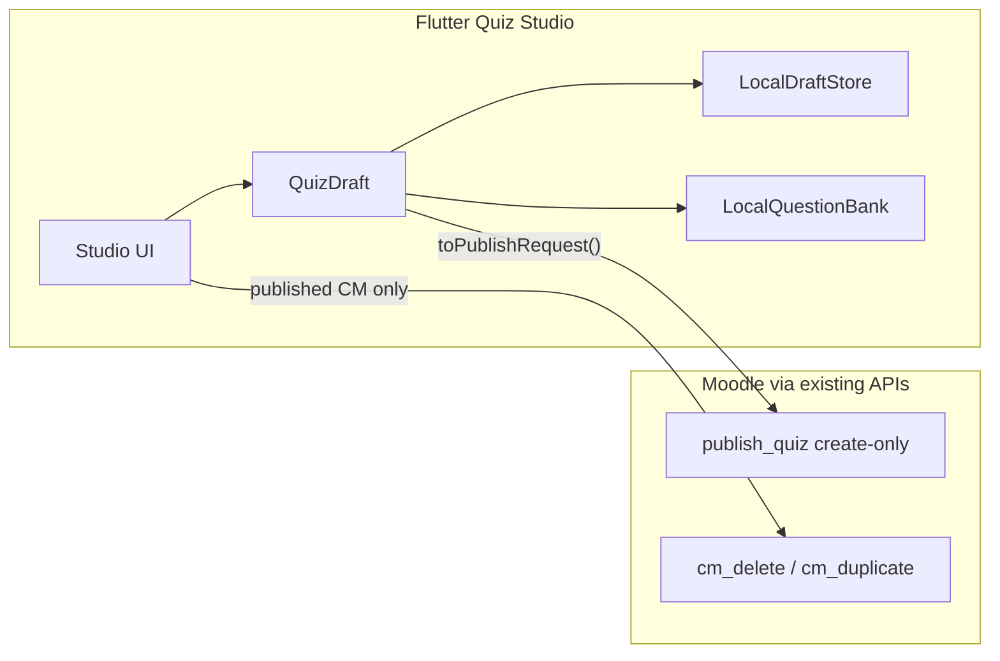

# Quiz Studio Phase 1B — Milestone Plan (Approach A)

**Status:** Approved direction — local authoring first; Moodle round-trip is Phase 2.  
**Constraint:** Keep `local_espace_publish_quiz` / `POST …/quiz/publish` create-only and stable.

## Prerequisite (done)

| Item | Fix |
|------|-----|
| `cm_delete` / `cm_duplicate` → `webservice_access_exception` | App tokens use `moodle_mobile_app`; `core_courseformat_update_course` was only on `espace`. Registered on Mobile in **local_espace 1.1.14**. |

Flow (unchanged): Flutter → `POST /courses/{id}/modules/actions` → FastAPI `course_editor` → `core_courseformat_update_course` (`cm_delete` / `cm_duplicate`).

## Architecture (1B)

- **`QuizDraft`** remains the canonical editing model.
- Local persistence = device storage (new); not Moodle.
- Published quizzes: duplicate/delete via existing CM actions only.
- No `update_quiz`, `get_quiz_for_studio`, or Moodle Question Bank in 1B.

## Feature → layer matrix

| # | Feature | Flutter | Backend / plugin |
|---|---------|---------|------------------|
| — | CM Delete / Duplicate (published) | Course UI (exists) | **1.1.14 Mobile WS** (done) |
| 4–7 | Reorder / dup / delete / undo questions | Yes | No |
| 8 | Teacher preview | Yes (local draft render) | No |
| 9–10 | Autosave + draft manager | Yes (`shared_preferences` / files) | No |
| 11 | Rich text | Yes (editor package) | No |
| 12 | Images in questions | Yes (local/embed in draft HTML) | Publish with Moodle files → **Phase 2** |
| 13 | LaTeX | Yes (TeX in HTML + preview) | No (Moodle MathJax after publish) |
| 14 | Quiz settings UI | Yes (on `QuizDraft`) | **Not applied on publish in 1B** (Phase 2) |
| 15 | Question Bank | Yes (**local** bank) | No |
| 16 | JSON import/export | Yes | No |
| 17 | Search / filter | Yes | No |
| 18 | UX polish | Yes | No |
| 1 | Edit existing Moodle quiz | Out of scope (Phase 2) | Phase 2 |
| — | Publish | Unchanged create pipeline | Unchanged |

## Milestones

### M0 — CM actions (complete)
Register `core_courseformat_update_course` on Mobile; verify duplicate/delete.

### M1 — Studio foundation
- Rename/clarify `QuizCreateScreen` → Studio shell (still create + publish).
- Extend `QuizDraft`: `id`, `updatedAt`, `settings` (local-only), stable question `id`s.
- Entry points: New quiz; open draft (manager lands in M3).

### M2 — Question list ops
- Drag-and-drop reorder (`ReorderableListView` / similar).
- Duplicate question, delete question, undo delete (snackbar + short-lived stack).

### M3 — Local drafts
- Autosave draft to disk/prefs (debounce).
- Draft manager: New / Open / Save / Discard.
- Dirty-state + leave confirmation (already partially present).

### M4 — Rich content
- Rich text (bold/italic/lists/links) for stem/intro.
- Image insert into draft HTML (local/data or file picker → embed).
- LaTeX insert + preview widget.

### M5 — Preview, bank, IO, search
- Teacher preview mode (read-only walkthrough of draft).
- Local question bank: save / reuse / search.
- JSON import/export of `QuizDraft`.
- Search/filter on canvas question list.

### M6 — Settings panel + polish
- Settings form on draft (time limit, attempts, shuffle, pass grade, dates) — **stored locally only**.
- Responsive layout, shortcuts, light motion.
- Keep publish sticky CTA; no API changes.

## Phase 2 (explicitly out of scope)

- `get_quiz_for_studio` / `update_quiz`
- Apply draft settings on Moodle update
- Moodle Question Bank
- AI / document import

## Success criteria for 1B

1. Teacher can author a polished draft offline-capable (local), publish once via existing API.
2. Question ops (reorder/dup/delete/undo) feel production-quality.
3. Drafts survive app restart.
4. Published quiz delete/duplicate work from course UI without WS access errors.
5. Publish pipeline unchanged and still green.

## Implementation status (in progress)

| Milestone | Status |
|-----------|--------|
| M0 CM delete/duplicate Mobile WS | Done (local_espace 1.1.14) |
| M1 Draft model + Studio shell | Done |
| M2 Reorder / dup / delete / undo | Done |
| M3 Autosave + draft manager | Done |
| M4 Rich text / image / LaTeX toolbar | Basic HTML/LaTeX insert toolbar (MVP) |
| M5 Preview, local bank, JSON, search | Done (MVP) |
| M6 Settings (local) + polish | Settings sheet done; polish ongoing |

